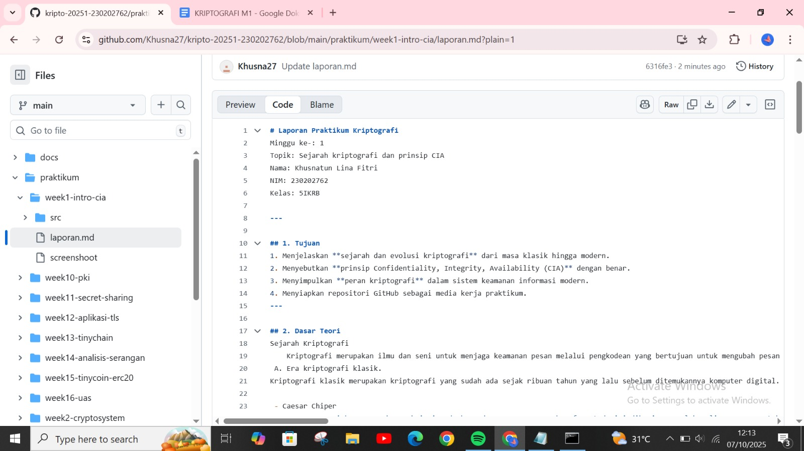
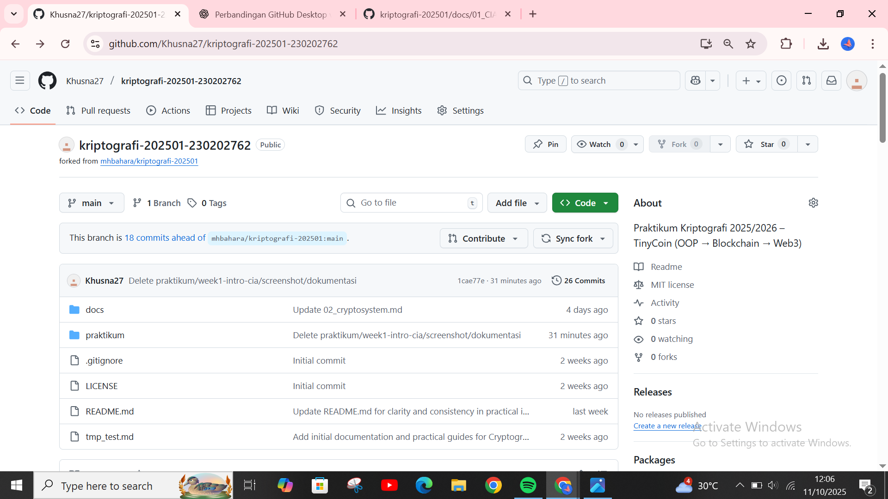

# Laporan Praktikum Kriptografi
Minggu ke-: 1
Topik: Sejarah kriptografi dan prinsip CIA 
Nama: Khusnatun Lina Fitri  
NIM: 230202762  
Kelas: 5IKRB  

---

## 1. Tujuan
1. Menjelaskan **sejarah dan evolusi kriptografi** dari masa klasik hingga modern.  
2. Menyebutkan **prinsip Confidentiality, Integrity, Availability (CIA)** dengan benar.  
3. Menyimpulkan **peran kriptografi** dalam sistem keamanan informasi modern.  
4. Menyiapkan repositori GitHub sebagai media kerja praktikum.
---

## 2. Dasar Teori
Sejarah Kriptografi
    Kriptografi merupakan ilmu dan seni untuk menjaga keamanan pesan melalui pengkodean yang bertujuan untuk mengubah pesan agar hanya bisa dipahami oleh pihak tertentu. Kriptografi telah melalui perkembangan sebagai berikut : 
	
### A. Era kriptografi klasik.
Kriptografi klasik merupakan kriptografi yang sudah ada sejak ribuan tahun yang lalu sebelum ditemukannya komputer digital. Kriptografi yang ada pada era klasik diantaranya : 

 - Caesar Chiper
		Caesar cipher merupakan enkripsi sederhana dengan pergeseran huruf. Metode ini diberi nama oleh Julius Caesar untuk melindungi pesan rahasianaya. Kode ini terdiri dari semua huruf pada teks asli (plaintext) disubstitusi dengan kode kemudian berubah menjadi huruf lain yang mempunyai selisih posisi tertentu dalam alfabet. Dalam caesar cipher hurufnya diubah dengan huruf selanjutnya dari posisi alphabet yang sama. Contoh penggunaanya dengan pergeseran 4 : 
Text asli (plaintext) : Kinan
Text tersandi (ciphertext) : O M R E R

- Vigenere
        Vigenere cipher merupakan kriptografi klasik yang diperkenalkan pada abad ke 16 oleh diplomat asal perancis yaitu Blaise de vigenere. Metode ini hampir mirip dengan caesar cipher dan vigenere cipher menerapkan metode substitusi abjad majemuk sehingga pada pesan yang dienkripsi bisa memiliki nilai pergeseran yang berbeda tergantung dengan kunci yang diberikan. 
Contoh penggunaanya : 
Kata kunci : TUGAS
Plaintext : KRIPTOGRAFI
Kunci : GASTUGASTUG
Ciphertext : QRAINUGJTZO

- Cipher Atbash
        Merupakan jenis kriptografi substitusi dengan cara kerja setiap huruf dibalik posisinya, sebagai contoh huruf A maka diganti menjadi huruf Z. Namun penggunaan jenis kriptografi ini memiliki tingkat keamanan yang rendah karena hanya memanfaatkan proses membalikan posisi karakter sebagai kuncinya. 
Contoh penggunaanya : 
Plainteks : Zahran 
Chipertext : A Z S I Z M

### B. Kriptografi Modern 
Kriptografi modern adalah era setelah ditemukannya komputer yang membuat ilmu kriptografi berkembang dengan pesat. Meskipun begitu algoritmanya tetap menggunakan teknik dasar kriptografi klasik yaitu teknik substitusi dan transposisi namun lebih kompleks. Contoh kriptografi modern sebagai berikut : 
        
- Kriptografi AES (Advanced Encryption Standard)
    Merupakan kriptografi yang diperkirakan menjadi standar utama dalam mengenkripsi semua bentuk data elektronik seperti perbankan dan transaksi finansial. Kelebihannya yaitu relatif cepat digunakan dalam software maupun hardware dan mudah untuk diimplementasikan dan hanya menggunakan memori yang kecil.
  
- Kriptografi RSA (Rivest Shamir Adleman)
    Merupakan algoritma yang digunakan untuk enkripsi kunci public (ppublic-key encryption) dan diketahui paling cocok untuk menandatangani (signing) dan untuk enkripsi dalam kriptografi kunci publik. Algoritma ini tidak berdasarkan pada proses enkripsi dan dekripsi, melainkan lebih kepada proses matematika yang dilakukan untuk menghasilkan kunci rahasia yang dapat disebarkan secara bebas tanpa harus khawatir karena kunci rahasia tersebut hanya dapat didekripsi hanya oleh pengirim dan penerima pesan. Dasar dari algoritma ini memfaktorkan bilangan yang besar menjadi faktor-faktor prima. Contoh penggunaanya yaitu untuk mengidentifikasi sebuah file dokumen dan memverifikasi keaslian dari dokumen tersebut.
  
- Enigma Machine
    Merupakan kriptografi yang digunakan oleh jerman selama perang dunia II. Penggunaanya mirip kriptografi vigenere namun jauh lebih kompleks karena memiliki jumlah kunci yang sangat besar.

### C. Kriptografi Kontemporer
Kriptografi kontemporer hampir mirip dengan kriptografi modern karena bekembang sejak era munculnya kpomputer namun berfokus pada teknik yang mengandalkan matematika dan algoritma yang kompleks untuk mengamankan data digital. Ciri khas kriptografi kontemporer yaitu berbasis bit, memiliki kompleksitas matematika yang tinggi dan kunci yang sangat panjang. Contohnya yaitu : 
        
- Blockchain 
	Merupakan sebuah buku besar digital yang tidak dapat diubah (immutable ledger) yang mencatat semua transaksi. Konsep inti dari blockchain adalah desentralisasi dimana tidak ada satu entitas pun yang mengendalikan seluruh sistem sehingga sangat tahan terhadap serangan dan manipulasi.

- Cryptocurrency
    Merupakan media pertukaran alternatif yang digunakan dengan pertimbangan keamanan, transparansi dan efektivitas biaya. Teknik  kriptografi  dengan  protokol  enkripsi  identifikasi  dan  verifikasi  transaksi memberikan suatu detail transaksi cryptocurrency  yang transparan dan identitas pengguna tetap anonim. Penetapan harga  pada  transaksi  ini  didasarkan  pada  penawaran  dan  permintaan. Selain itu transaksi crypto dapat menurunkan biaya transaksi, serta menekan biaya pengiriman uang. Cryptocurrency  menjadi  mata  uang  digital  yang  tidak  dikeluarkan  oleh  otoritas  pusat  mana  pun,  sehingga  tidak  terpengaruh  dengan  kebijakan  moneter.

Prinsip CIA
    Prinsip CIA (Confidentiality Integrity Availability) merupakan model keamanan yang sederhana dan dapat diterapkan secara luas. Prinsip ini digunakan pada bidang analisis keamanan, mulai dari akses ke riwayat internet pengguna hingga keamanan data yang terenkripsi.
Tiga pilar keamanan informasi ; 

- Confidentiality (Kerahasiaan)
    Merupakan prinsip yang memastikan bahwa informasi hanya dapat diakses atau dilihat oleh pihak yang berwenang saja. Salah satu contoh upaya yang dapat dilakukan yaitu dengan penerapanan kriptografi dan enkripsi untuk memastikan kerahasiaan data yang ditransfer dari komputer satu ke lainnya.
Contoh nyata, saat mengakses akun bank atau membuat m banking selain membuat password biasanya juga akan dikirim kode verifikasi ke ponsel. Jadi meskipun peretas mengetahui password nya tetap tidak akan bisa masuk ke dalam m banking kita keran tidak dapat membobol lapisan kedua yaitu tidak mengetahui kode verifikasi nya.

- Integrity (Integritas)
	Merupakan prinsip yang memastikan data yang diterima tidak berubah dari informasi asli dan bebas dari perubahan yang tidak sengaja maupun sengaja. Contoh penerapannya dengan membuat cadangan atau backup data dan penggunaan tanda tangan digital. 
Contoh nyata, saat ini sudah banyak digunakan tanda tangan digital untuk surat-surat penting seperti pada kartu keluarga maupun ijazah kelulusan.

- Availability (Ketersediaan)
	Merupakan prinsip yang memastikan bahwa informasi yang dimaksud hanya boleh diakses oleh pihak yang berwenang kapanpun saat dibutuhkan. Hal ini bertujuan untuk mencegah gangguan layanan dan memastikan operasional yang berkelanjutan. Contoh penerapannya dengan membuat redundansi (server cadangan), backup data dan pembaruan atau pemulihan sistem.
Contoh nyata, dengan melakukan backup reguler setiap pekerjaan yang sudah selesai ke penyimpanan eksternal sehingga jika terjadi rusak pada hardware masih mempunyai backup yang terbaru.

---

## 3. Alat dan Bahan 
- Visual Studio Code  
- Git dan akun GitHub  
- Terminal CMD
- Browser (Google Schollar)

---

## 4. Langkah Percobaan
Melakukan fork repository kriptografi  
- Melakukan clone repository ke komputer lokal.  
- Membuat folder `praktikum/week1-intro-cia/` berisi `laporan.md` dan folder `screenshots`.  
- Menulis ringkasan materi singkat.  
- Menjawab quiz.

---
## 5. Source Code
Belum ada
---

## 6. Hasil dan Pembahasan
  
  

## 7. Quiz
1. Siapa tokoh yang dianggap sebagai bapak kriptografi modern?
Jawaban : Claude Shannon merupakan orang pertama yang meletakkan dasar ilmiah dan matematis bagi kriptografi modern melalui karya monumentalnya yang berjudul 'Communication Theory of Secrecy Systems' (1949). Selain itu ada juga tokoh penting lain yang sering disebut sebagai pelopor kriptografi modern praktis adalah Whitfield Diffie dan Martin Hellman, yang memperkenalkan kriptografi kunci publik (public-key cryptography) pada tahun 1976.
   
2. Sebutkan algoritma kunci public yang populer digunakan saat ini.
Jawaban : RSA (Rivest shamir adleman), ECC (Elliptic curve cryptography dan Diffie hellman.

3. Apa perbedaan utama kriptografi klasik dan kriptografi modern?
Jawaban : Kriptografi klasik masih menggunakan teknik substitusi dan transposisi pada huruf serta biasanya menggunakan kunci simetris. Sedangkan kriptografi modern sudah menggunakan matematika dan komputer namun masih menggunakan metode substitusi dan transposisi namun lebih kompleks.

---
## 8. Kesimpulan
Kriptografi adalah ilmu yang berfungsi menjaga keamanan pesan agar hanya dapat diakses oleh pihak yang berwenang.  
Perkembangannya dimulai dari **era klasik** seperti *Caesar Cipher* dan *Vigenère Cipher*, berlanjut ke **era modern** seperti *AES* dan *RSA*, hingga **era kontemporer** seperti *Blockchain* dan *Cryptocurrency*.  

Penerapan kriptografi mendukung prinsip **CIA (Confidentiality, Integrity, Availability)** untuk menjamin kerahasiaan, keaslian, dan ketersediaan data.  
Secara keseluruhan, kriptografi berperan penting dalam menjaga keamanan informasi di era digital.
 

---

## 9. Daftar Pustaka
---

## 10 Commit Log

commit week1-intro-cia
Author: Khusnatun Lina Fitri <husnatunlinafitri@gmail.com>
Date:   2025-10-6

   
```
