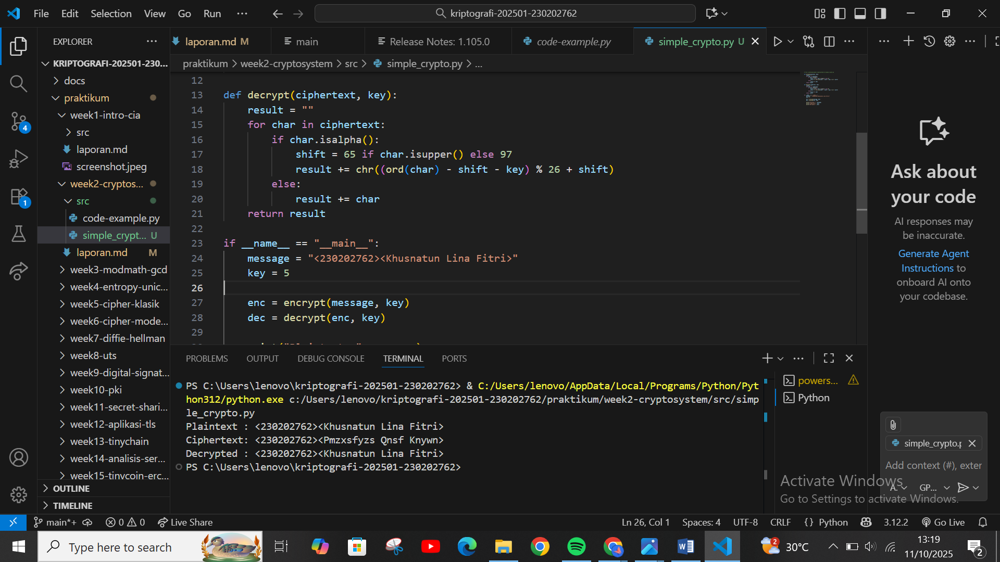

# Laporan Praktikum Kriptografi
Minggu ke-: 2 
Topik: Cryptosystem (Komponen, Enkripsi & Dekripsi, Simetris & Asimetris)  
Nama: Khusnatun Lina Fitri  
NIM: 230202762 
Kelas: 5IKRB  

---

## 1. Tujuan
1. Mengidentifikasi komponen dasar kriptosistem (plaintext, ciphertext, kunci, algoritma).  
2. Menggambarkan proses enkripsi dan dekripsi sederhana.  
3. Mengklasifikasikan jenis kriptosistem (simetris dan asimetris).  


---

## 2. Dasar Teori
### Membuat skema kriptosistem


### Implementasi program sederhana
Simulasi enkripsi & dekripsi menggunakan substitusi sederhana (misalnya Caesar Cipher).
```
# file: praktikum/week2-cryptosystem/src/simple_crypto.py

def encrypt(plaintext, key):
    result = ""
    for char in plaintext:
        if char.isalpha():
            shift = 65 if char.isupper() else 97
            result += chr((ord(char) - shift + key) % 26 + shift)
        else:
            result += char
    return result

def decrypt(ciphertext, key):
    result = ""
    for char in ciphertext:
        if char.isalpha():
            shift = 65 if char.isupper() else 97
            result += chr((ord(char) - shift - key) % 26 + shift)
        else:
            result += char
    return result

if __name__ == "__main__":
    message = "<230202762><Khusnatun Lina Fitri>"
    key = 5

    enc = encrypt(message, key)
    dec = decrypt(enc, key)

    print("Plaintext :", message)
    print("Ciphertext:", enc)
    print("Decrypted :", dec)
```
Ekspektasi Keluaran 
```
Plaintext : <230202762><Khusnatun Lina Fitri>
Ciphertext: <230202762><Pmzxsfyzs Qnsf Knywn>
Decrypted : <230202762><Khusnatun Lina Fitri>
```
---
### Klasifikasi Simetris & Asimetris

####  1. Kriptografi Simetris
Kriptografi simetris menggunakan satu kunci yang sama untuk proses enkripsi dan dekripsi.  
Prosesnya lebih cepat karena operasi matematikanya sederhana, namun keamanannya bergantung sepenuhnya pada satu kunci tunggal namun jika kunci tersebut bocor, maka seluruh sistem bisa terbuka.  
Algoritma jenis ini cocok digunakan untuk enkripsi data dalam jumlah besar karena mudah diterapkan dan efisien.

**Contoh Algoritma:**

- **a. AES (Advanced Encryption Standard)**  
  Sistem penyandian blok dengan panjang 128 bit, digunakan secara luas karena efisien dan aman.  
  **Contoh penggunaan:** keamanan internet melalui TLS/SSL/HTTPS serta jaringan nirkabel (WPA2/WPA3).

- **b. DES (Data Encryption Standard)**  
  Sistem penyandian blok 64 bit, dengan 56 bit sebagai kunci dan 8 bit untuk paritas.  
  Saat ini dianggap kurang aman karena panjang kuncinya terlalu pendek.  
  **Contoh penggunaan:** sistem pembayaran dan ATM untuk enkripsi PIN, serta keamanan jaringan pribadi (VPN).

---

#### 2. Kriptografi Asimetris
Kriptografi asimetris menggunakan dua kunci berbeda, yaitu kunci publik untuk enkripsi dan kunci privat untuk dekripsi.  
Prosesnya lebih lambat karena perhitungan matematikanya lebih kompleks, namun lebih aman karena pesan hanya bisa didekripsi oleh pemilik kunci privat, meskipun kunci publik diketahui umum.

**Contoh Algoritma:**

- **a. RSA (Rivest–Shamir–Adleman)**  
  Menggunakan dua kunci, publik untuk enkripsi dan privat untuk dekripsi.  
  **Contoh penggunaan:** tanda tangan digital dan distribusi kunci.

- **b. ECC (Elliptic Curve Cryptography)**  
  Menggunakan kunci dengan panjang 256 bit berbasis operasi titik kurva elips yang sulit dibalik dan sangat aman.  
  **Contoh penggunaan:** mata uang kripto (blockchain) dan otoritas sertifikat digital.

---


---
## 3. Alat dan Bahan

- Python 3.x  
- Visual Studio Code 
- Git dan akun GitHub  
- Google chrome
- Google schollar.

---

## 4. Langkah Percobaan
1. Membuat file `simple_crypto.py` di folder `praktikum/week2-cryptosystem/src/`.
2. Menyalin kode program dari panduan praktikum.
3. Menjalankan program dengan perintah `python simple_crypto.py`.)
4. Membuat ringkasan perbedaan antara kriptosistem simetris dan asimetris.
5. Mengaploud hasil eksekusi di folder `praktikum/week2-cryptosistem/screenshots/`
6. Menjawab pertanyaan diskusi.

---

## 5. Source Code
```
file: praktikum/week2-cryptosystem/src/simple_crypto.py

def encrypt(plaintext, key):
    result = ""
    for char in plaintext:
        if char.isalpha():
            shift = 65 if char.isupper() else 97
            result += chr((ord(char) - shift + key) % 26 + shift)
        else:
            result += char
    return result

def decrypt(ciphertext, key):
    result = ""
    for char in ciphertext:
        if char.isalpha():
            shift = 65 if char.isupper() else 97
            result += chr((ord(char) - shift - key) % 26 + shift)
        else:
            result += char
    return result

if __name__ == "__main__":
    message = "<230202762><Khusnatun Lina Fitri>"
    key = 5

    enc = encrypt(message, key)
    dec = decrypt(enc, key)

    print("Plaintext :", message)
    print("Ciphertext:", enc)
    print("Decrypted :", dec)
```
---
## 6. Hasil dan Pembahasan

Diagram Kriptosistem : 


Hasil eksekusi program Caesar Cipher:




---

## 7. Jawaban Pertanyaan
(Jawab pertanyaan diskusi yang diberikan pada modul.  
- Pertanyaan 1: …  
- Pertanyaan 2: …  
)
---

## 8. Kesimpulan
(Tuliskan kesimpulan singkat (2–3 kalimat) berdasarkan percobaan.  )

---

## 9. Daftar Pustaka
(Cantumkan referensi yang digunakan.  
Contoh:  
- Katz, J., & Lindell, Y. *Introduction to Modern Cryptography*.  
- Stallings, W. *Cryptography and Network Security*.  )

---

## 10. Commit Log
(Tuliskan bukti commit Git yang relevan.  
Contoh:
```
commit abc12345
Author: Nama Mahasiswa <email>
Date:   2025-09-20

    week2-cryptosystem: implementasi Caesar Cipher dan laporan )
```
