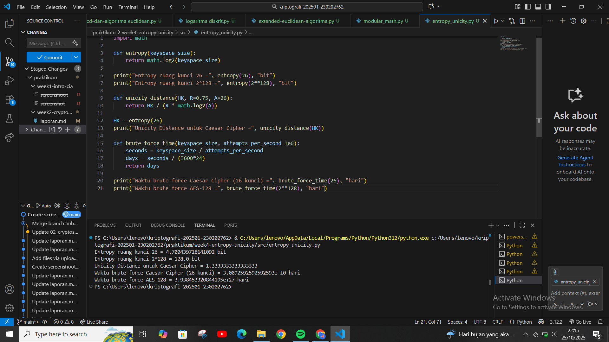

# Laporan Praktikum Kriptografi
Minggu ke-: 4  
Topik: Entropy & Unicity Distance (Evaluasi Kekuatan Kunci dan Brute Force)
Nama: Khusnatun Lina Fitri
NIM: 230202762
Kelas: 5IKRB

---

## 1. Tujuan
1. Menyelesaikan perhitungan sederhana terkait entropi kunci.
2. Menggunakan teorema Euler pada contoh perhitungan modular & invers.
3. Menghitung unicity distance untuk ciphertext tertentu.
4. Menganalisis kekuatan kunci berdasarkan entropi dan unicity distance.
5. Mengevaluasi potensi serangan brute force pada kriptosistem sederhana.

---

## 2. Dasar Teori

Entropy dalam kriptografi adalah ukuran ketidakpastian dalam ruang kunci, dimana semakin besar entropy maka semakin sulit untuk menebak kunci yang benar karena banyak kemungkinan kunci yang harus dicoba.
Sedangkan Unicity distance adalah panjang chipertext minimum yang diperlukan agar penyerang bisa menentukan satu-satunya kunci yang benar dengan pasti.

---

## 3. Alat dan Bahan
- Python 3.x  
- Visual Studio Code 
- Git dan akun GitHub
- Google chrome

---

## 4. Langkah Percobaan

1. Membuat file `entropy_unicity.py` di folder `praktikum/week4-entropy_unicity/src/`.
2. Menyalin kode program dari panduan praktikum.
3. Menjalankan program dengan perintah `python entropy_unicity.py`.

---

## 5. Source Code

```
import math

def entropy(keyspace_size):
    return math.log2(keyspace_size)

print("Entropy ruang kunci 26 =", entropy(26), "bit")
print("Entropy ruang kunci 2^128 =", entropy(2**128), "bit")

def unicity_distance(HK, R=0.75, A=26):
    return HK / (R * math.log2(A))

HK = entropy(26)
print("Unicity Distance untuk Caesar Cipher =", unicity_distance(HK))

def brute_force_time(keyspace_size, attempts_per_second=1e6):
    seconds = keyspace_size / attempts_per_second
    days = seconds / (3600*24)
    return days

print("Waktu brute force Caesar Cipher (26 kunci) =", brute_force_time(26), "hari")
print("Waktu brute force AES-128 =", brute_force_time(2**128), "hari")
```
---

## 6. Hasil dan Pembahasan
```
Entropy ruang kunci 26 = 4.700439718141092 bit
Entropy ruang kunci 2^128 = 128.0 bit
Unicity Distance untuk Caesar Cipher = 1.3333333333333333
Waktu brute force Caesar Cipher (26 kunci) = 3.0092592592592593e-10 hari
Waktu brute force AES-128 = 3.938453320844195e+27 hari
```
Pembahasan : 

1. Entropy ruang kunci 26 = 4.700439718141092 bit (Entropy nya sangat rendah karena hanya ada 26 kemungkinan pergeseran dan keamanan kunci hanya setara dengan kurang dari 5 bit data biner)
   
2. Entropy ruang kunci 2^128 = 128.0 bit ( Penggunaan entropy sangat tinggi karena ada 128.0 kemungkinan kunci unik)
   
3. Unicity Distance untuk Caesar Cipher = 1.3333333333333333 ( Panjang chipertext hanya sepanjang 1 sampai 2 huruf sehingga sangat mudah untuk memecahkan kode dengan menganalisis frekuensinya).

4. Waktu brute force Caesar Cipher (26 kunci) = 3.0092592592592593e-10 hari (Pemecahan kunci dapat dilakukan dengan mencoba semua 26 kunci secara instan dalam waktu hitungan detik).

5. Waktu brute force AES-128 = 3.938453320844195e+27 hari ( Jumlah waktu yang digunakan sangat lama sehingga tidak memungkinkan untuk memecahkan kode dengan brute force).
```
Hasil eksekusi program entropy_unicity :


---

## 7. Jawaban Pertanyaan

1. Apa arti dari nilai entropy dalam konteks kekuatan kunci?
Nilai entropy dalam konteks kekuatan kunci adalah untuk mengukur tingkat ketidakpastian atau kekacauan dalam kunci/ data. Jadi semakin tinggi nilai entropy maka semakin acak dan sulit untuk memprediksi kode kunci.
2. Mengapa unicity distance penting dalam menentukan keamanan suatu cipher?

3. Mengapa brute force masih menjadi ancaman meskipun algoritma sudah kuat?

## 8. Kesimpulan
(Tuliskan kesimpulan singkat (2–3 kalimat) berdasarkan percobaan.  )

---

## 9. Daftar Pustaka
(Cantumkan referensi yang digunakan.  
Contoh:  
- Katz, J., & Lindell, Y. *Introduction to Modern Cryptography*.  
- Stallings, W. *Cryptography and Network Security*.  )

---

## 10. Commit Log

```
week4-entropy-unicity
Author: Khusnatun Lina Fitri <husnatunlinafitri@gmail.com>
Date:   2025-10-25

   week4-entropy-unicity: Entropy & Unicity Distance (Evaluasi Kekuatan Kunci dan Brute Force)
```
